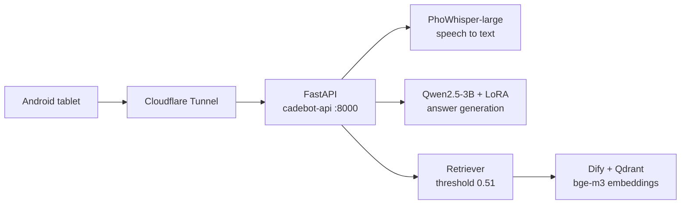

# Cadebot

[](https://github.com/tduybao7605/Qwen2.5-3B-fine-tuned/actions/workflows/ci.yml)
[](https://www.python.org/downloads/)
[](LICENSE)

A Vietnamese-language voice assistant for coffee shops. A tablet at the table
listens, transcribes, answers questions about the menu, and drafts an order —
running on a fine-tuned 3B model that is grounded in the shop's own knowledge
base, so it declines to answer rather than inventing a price.

**Stack:** FastAPI · PhoWhisper-large (STT) · Qwen2.5-3B-Instruct + LoRA ·
BGE-M3 retrieval over Dify + Qdrant · Jetpack Compose (Android) · Docker Compose

| | |
|---|---|
| Out-of-scope questions blocked | **14/15**, in **0.096 s** — without invoking the LLM |
| Retrieval F1 / precision / recall | **0.968 / 0.938 / 1.000** (30 calibration queries, threshold 0.51) |
| Knowledge segments keeping provenance | **69/69** carry their `[chunk_id]` tag |
| Fine-tuning | LoRA over 144 training examples, 6 intents, loss 2.53 → 0.16 |

This README is a step-by-step setup guide. Read it top to bottom the first time;
after that, [docs/deployment.md](docs/deployment.md) is the operations manual.

**Contents:** [Architecture](#architecture-at-a-glance) ·
[Prerequisites](#prerequisites) · [Setup](#setup-step-by-step) ·
[Run modes](#run-modes) · [Android client](#android-client) ·
[Verifying it works](#verifying-it-works) · [Repository map](#repository-map) ·
[Documentation](#documentation) · [Common problems](#common-problems) ·
[Limitations](#limitations)

---

## Architecture at a glance



One FastAPI process holds both models in memory. A turn is: audio → `/stt` →
text → `/chat`. `/chat` embeds the question and matches it against the shop's
knowledge base first; if nothing clears the similarity threshold the server
returns a fixed "ask a staff member" answer **without ever calling the language
model**. The host machine opens no inbound ports — traffic arrives through an
outbound Cloudflare Tunnel.

→ Full detail in [docs/architecture.md](docs/architecture.md).

---

## Prerequisites

| Requirement | Notes |
|---|---|
| **Python 3.12** | Pins in `requirements.txt` were measured on 3.12. `pyproject.toml` sets `requires-python = ">=3.12"` |
| **Docker + Docker Compose** | For both the Cadebot container and the Dify stack |
| **Ollama** | Serves the `bge-m3` embedding model that Dify calls |
| **~20 GB free disk** | ~12–15 GB for the Dify images, ~6 GB for model weights |
| **~8 GB free RAM** | Qwen2.5-3B fp16 (~6 GB) plus PhoWhisper-large (~3.1 GB fp32) live in the same process |
| GPU | **Optional.** CPU is the documented and deployed path; the Dockerfile installs a CPU-only torch wheel on purpose |
| Android Studio | Only if you want to build the tablet client |

Without a GPU everything works, just slowly — see [Limitations](#limitations)
and [docs/performance.md](docs/performance.md).

---

## Setup, step by step

Order matters: Dify has to exist before the Cadebot container starts, because
`docker-compose.yml` joins Dify's Docker network.

### 1. Clone the repository

```bash
git clone https://github.com/tduybao7605/Qwen2.5-3B-fine-tuned.git
cd Qwen2.5-3B-fine-tuned
```

The LoRA adapter under `cadebot-lora/` is stored with Git LFS. If `git lfs` was
not installed at clone time:

```bash
git lfs install && git lfs pull
```

**Expected:** `cadebot-lora/adapter_model.safetensors` is a few hundred MB, not
a ~130-byte pointer file.

### 2. Create your local config file

```bash
cp .env.example .env
```

`.env` is gitignored. Leave the values as they are for now — you fill in the
Dify credentials in step 5.

### 3. Install Ollama and pull the embedding model

```bash
curl -fsSL https://ollama.com/install.sh | sh
ollama pull bge-m3

# Verify the vector dimension BEFORE building the knowledge base.
curl -s http://127.0.0.1:11434/api/embed \
  -d '{"model":"bge-m3","input":"Viva Latte giá bao nhiêu"}' \
  | python3 -c "import json,sys; print('dim =', len(json.load(sys.stdin)['embeddings'][0]))"
```

**Expected:** `dim = 1024`. Anything else means `EMBEDDING_DIM` in
`src/cadebot/rag/config.py` must be changed *before* any KB is created —
changing it later forces a full re-embed.

Ollama listens on `127.0.0.1` only, which Dify's containers cannot reach. Start
the relay that republishes it on the `docker0` bridge:

```bash
python3 knowledge_base/ollama_docker_bridge.py &
```

### 4. Bring up the Dify stack

```bash
git clone --depth 1 https://github.com/langgenius/dify.git <path-to>/dify
cp <path-to>/dify/docker/.env.example <path-to>/dify/docker/.env
```

Add the Qdrant settings to `<path-to>/dify/docker/.env` (Dify 1.16.1 does not
ship them):

```
VECTOR_STORE=qdrant
QDRANT_URL=http://qdrant:6333
QDRANT_API_KEY=difyai123456
QDRANT_CLIENT_TIMEOUT=20
QDRANT_GRPC_ENABLED=false
QDRANT_GRPC_PORT=6334
```

Start it with **both** profiles — omitting `postgresql` makes `plugin_daemon`
and `nginx` crash-loop:

```bash
cd <path-to>/dify/docker && docker compose --profile postgresql --profile qdrant up -d
curl -s -o /dev/null -w "%{http_code}\n" http://localhost/
```

**Expected:** `307`. Then open `http://localhost/install` and create the admin
account.

### 5. Register BGE-M3 in Dify, create the dataset, get the API key

Three things have to happen in the Dify UI/API; the full walkthrough with
screenshots' worth of detail is in [docs/rag-setup.md](docs/rag-setup.md) §4
(Vietnamese). In short:

1. **Install the Ollama plugin** (`http://localhost/plugins` → Marketplace →
   Ollama → Install). Dify 1.x does not bundle it; without it the API replies
   `Provider langgenius/ollama/ollama does not exist.`
2. **Add the model**: Settings → Model Providers → Ollama → Add Model, type
   `Text Embedding`, name `bge-m3`, base URL `http://172.17.0.1:11434`, context
   size and max tokens `8192`.
3. **Create the dataset via the API**, not the UI — a UI-created knowledge base
   has no embedding model bound and cannot be fixed afterwards. Then create a
   **Dataset** API key under Knowledge → API Access. (The App API key is a
   different key and returns 401.)

Put the dataset id and key into `.env`:

```
DIFY_BASE_URL=http://localhost/v1
DIFY_DATASET_API_KEY=dataset-...
DIFY_DATASET_ID=...
```

**Expected:** this returns JSON rather than a 401:

```bash
set -a && source .env && set +a
curl -s "$DIFY_BASE_URL/datasets/$DIFY_DATASET_ID/documents" \
  -H "Authorization: Bearer $DIFY_DATASET_API_KEY" | head -c 300
```

### 6. Sync the knowledge base

Run this from the host, with `.env` loaded:

```bash
set -a && source .env && set +a
python3 scripts/sync_kb.py --dry-run    # prints, no network
python3 scripts/sync_kb.py              # upserts into Dify
```

**Expected:** `Markdown: 34 chunks | Database: 35 chunks` — 69 total. The real
run pushes exactly **two** documents (`cadebot_kb_markdown.md` and
`cadebot_kb_database.md`); the sync is idempotent, so running it five times
still leaves two.

Wait for Dify to finish indexing (Knowledge → Documents → status **Available**)
before moving on.

### 7. Build and start the API

```bash
make up      # docker compose up -d --build
make logs    # follow the boot; Ctrl+C detaches without stopping the container
```

**Expected:** the log ends with `✅ STT ready!`, `✅ Chat model ready!` and a
`✅ RAG ready (bge-m3, threshold=0.51, probe top_score=...)` line. First boot
downloads ~6 GB of weights into a named Docker volume and takes several minutes;
later boots reuse it.

### 8. Confirm it is healthy

```bash
make health
```

**Expected:**

```json
{"status":"ok","stt_ready":true,"chat_ready":true,"rag_ready":true,
 "embedding_model":"bge-m3","score_threshold":0.51}
```

`rag_ready: false` means the Dify credentials were missing or wrong when the
container started — fix `.env`, then `make restart`.

---

## Run modes

### Docker — how it is deployed

```bash
make up        # build + start in the background
make logs      # watch it come up
make health    # readiness of STT, chat and RAG
make down      # stop
```

Requires the Dify stack to be running first. Full topology, image rationale,
`make` target reference and troubleshooting: [docs/deployment.md](docs/deployment.md).

### Local development — no container

```bash
pip install -r requirements.txt
python3 -m pytest tests/ -q     # 49 tests; no models, no network, seconds
set -a && source .env && set +a
python3 -m cadebot              # uvicorn on HOST:PORT, default 0.0.0.0:8000
```

`python3 -m cadebot` loads the same models as the container, so expect the same
multi-minute first start. Without Dify credentials it still boots, prints a
warning, and serves `/chat` with `rag_ready: false`.

The test suite is the fast feedback loop: it exercises chunking, KB assembly,
retrieval parsing, prompt sanitizing and the `/chat` contract with the models
stubbed out.

---

## Android client

The tablet app lives in `Cadebot_UI/` (Jetpack Compose). It records audio, posts
it to the server's `/stt`, sends the transcript to `/chat`, and speaks the answer
with the Android TTS engine. Both calls go to the same Cadebot server — speech
recognition runs on our own PhoWhisper-large, so there is no third-party service
and no API key to obtain.

A prebuilt debug APK is attached to the
[v1.0.0 release](https://github.com/tduybao7605/Qwen2.5-3B-fine-tuned/releases/tag/v1.0.0).
It is compiled with the default `http://10.0.2.2:8000`, which only works from an
Android emulator running on the same machine as the server — **for a real device
you must rebuild** with your own server address:

```bash
cd Cadebot_UI
cp local.properties.example local.properties
```

Fill in `local.properties` — it is gitignored and must never be committed:

| Key | Value |
|---|---|
| `sdk.dir` | Path to your Android SDK (Android Studio usually writes this itself) |
| `cadebot.api.url` | `http://10.0.2.2:8000` for the emulator, `http://<lan-ip>:8000` for a real device on the same network, or your server's public hostname |

`cadebot.api.url` is compiled into `BuildConfig.CADEBOT_API_URL`; if the key is
absent the build falls back to `http://10.0.2.2:8000`, the emulator's alias for
the host machine.

Then open the project in Android Studio and run, or build from the command line
with `./gradlew assembleDebug`.

→ Client-side detail: [docs/android-client.md](docs/android-client.md) (Vietnamese).

---

## Verifying it works

With the server running on `localhost:8000`:

**1. Readiness**

```bash
curl -s localhost:8000/health | python3 -m json.tool
```

```json
{
    "status": "ok",
    "stt_ready": true,
    "chat_ready": true,
    "rag_ready": true,
    "embedding_model": "bge-m3",
    "score_threshold": 0.51
}
```

**2. Retrieval only — fast, no LLM**

```bash
curl -s -X POST localhost:8000/retrieve \
  -H 'Content-Type: application/json' \
  -d '{"query":"Trà Đào Cam Sả giá bao nhiêu"}' | python3 -m json.tool
```

```json
{
    "in_scope": true,
    "top_score": 0.82,
    "threshold": 0.51,
    "chunks": [{"chunk_id": "menu:VR_PEACH_TEA", "score": 0.82, "text": "Món: Trà Đào Cam Sả ..."}]
}
```

`in_scope: false` with an empty `chunks` list means the KB was never synced or
Dify has not finished indexing.

**3. An in-scope question — grounded, with provenance**

`/chat` is grounded by default (`use_rag` defaults to `true`), so the Android
payload shape is enough:

```bash
curl -s -X POST localhost:8000/chat \
  -H 'Content-Type: application/json' \
  -d '{"message":"Trà Đào Cam Sả giá bao nhiêu","history":[]}' | python3 -m json.tool
```

```json
{
    "response": "{\"intent\":\"MENU_QA\",\"answerText\":\"Trà Đào Cam Sả có giá 45.000 VNĐ bạn nhé!\",\"requiresHumanSupport\":false,\"sourceIds\":[\"menu:VR_PEACH_TEA\"]}",
    "retrieval": {"in_scope": true, "top_score": 0.82, "threshold": 0.51,
                  "sourceIds": ["menu:VR_PEACH_TEA"]}
}
```

Note that `response` is a **string containing JSON** — clients parse it a second
time. `sourceIds` is populated, and any ID the model invented has already been
stripped. On CPU this call takes 142-184 s depending on machine load; see the latency table in docs/deployment.md.

**4. An out-of-scope question — blocked before the model runs**

```bash
time curl -s -X POST localhost:8000/chat \
  -H 'Content-Type: application/json' \
  -d '{"message":"hôm nay trời có mưa không"}' | python3 -m json.tool
```

```json
{
    "response": "{\"intent\":\"FALLBACK\",\"confidence\":1.0,\"answerText\":\"Xin lỗi bạn, mình chưa có thông tin chính xác về điều này...\",\"requiresHumanSupport\":true,\"sourceIds\":[]}",
    "retrieval": {"in_scope": false, "top_score": 0.21, "threshold": 0.51, "sourceIds": []}
}
```

**This should come back in about 0.1 s.** If it takes minutes, the LLM was
invoked, which means retrieval considered the question in scope — check
`top_score` against the threshold.

**5. The whole eval set**

```bash
set -a && source .env && set +a
python3 scripts/eval_rag.py --fast    # retrieval only, needs the server running
```

Runs all 30 queries in `eval/rag_queries.json`. Expected: 15/15 in-scope found,
14/15 out-of-scope blocked — the one that slips through is documented in
[docs/rag-setup.md](docs/rag-setup.md).

→ Every endpoint, field by field: [docs/api-reference.md](docs/api-reference.md).

---

## Repository map

| Path | What is in it |
|---|---|
| `src/cadebot/` | The server package — `api.py` (routes), `models.py` (loaders), `__main__.py` (entrypoint) |
| `src/cadebot/rag/` | Retrieval: config, chunking, KB assembly, Dify client, retriever, prompt building |
| `scripts/` | `sync_kb.py`, `calibrate_threshold.py`, `eval_rag.py` |
| `training/` | LoRA fine-tuning, adapter merge, offline evaluation (needs CUDA) |
| `knowledge_base/` | Source of truth for the KB: five markdown files, `demo_cafe.db`, `schema.sql`, `ollama_docker_bridge.py` |
| `eval/` | `rag_queries.json` — 15 in-scope + 15 out-of-scope calibration queries |
| `tests/rag/` | The test suite (49 tests) |
| `pipeline/` | Standalone local voice loop (VAD → STT → LLM → TTS), no Android needed |
| `Cadebot_UI/` | Android client, Jetpack Compose |
| `cadebot-lora/` | The trained LoRA adapter (Git LFS) |
| `docs/` | Everything below |

Configuration lives in exactly two places: `.env` (secrets and tunables, from
`.env.example`) and `src/cadebot/rag/config.py` (defaults, each with a comment
explaining how the number was arrived at).

---

## Documentation

| Document | Language | Contents |
|---|---|---|
| [docs/architecture.md](docs/architecture.md) | English | Components, request flows, key design decisions, known limitations |
| [docs/deployment.md](docs/deployment.md) | English | Docker topology, image rationale, quick start, `make` reference, tunnel, troubleshooting |
| [docs/api-reference.md](docs/api-reference.md) | English | The four endpoints, schemas, `curl` examples, latency |
| [docs/rag-setup.md](docs/rag-setup.md) | Vietnamese | Standing up Dify + Qdrant + BGE-M3, plus the measured evaluation results |
| [docs/model-training.md](docs/model-training.md) | Vietnamese | Fine-tuning report: dataset, hyperparameters, evaluation |
| [docs/model-training-log.md](docs/model-training-log.md) | Vietnamese | Blow-by-blow log of the fine-tuning run |
| [docs/performance.md](docs/performance.md) | Vietnamese | Latency measurements on CPU and the GPU projection |
| [docs/android-client.md](docs/android-client.md) | Vietnamese | Android integration: recording, STT, calling `/chat` |
| [docs/voice-pipeline.md](docs/voice-pipeline.md) | Vietnamese | Local environment for the standalone voice loop |

---

## Common problems

| Symptom | Fix |
|---|---|
| `docker compose up` fails: network `docker_default` not found | The Dify stack is not running — do setup step 4 first |
| `plugin_daemon` / `nginx` crash-looping | Started before Postgres was healthy: `docker restart docker-plugin_daemon-1 docker-nginx-1` |
| `/health` shows `rag_ready: false` | `DIFY_DATASET_API_KEY` / `DIFY_DATASET_ID` missing or wrong in `.env`, then `make restart` |
| Dify returns 401 | You used the App API key; create a **Dataset** key under Knowledge → API Access |
| Client gets HTTP 524 | A grounded turn exceeded the tunnel's 100 s limit — that client sends `{"use_rag": false}`, or reach the host off-tunnel |
| First boot looks hung | It is downloading ~6 GB of weights; `make logs` and wait for `✅ Chat model ready!` |
| Retrieved chunks show `chunk_id: "unknown"` | A segment lost its `[id]` line — re-run `python3 scripts/sync_kb.py` |

Fuller table, with causes: [docs/deployment.md](docs/deployment.md#troubleshooting).

---

## Limitations

- **142-184 s per grounded answer** on the CPU-only deployment machine (measured
  twice, the spread is machine load), and ~150 s
  to transcribe 5 s of audio. The fix is INT4 quantization or a GPU, not more
  retrieval work.
- **Grounding blocks fabricated numbers, not fabricated attributes.** Prices and
  source IDs come out right; the model can still carry a property across from a
  neighbouring retrieved chunk.
- **Single-process serving, no auth.** One uvicorn process holds both models;
  concurrent `/chat` calls serialize behind the GIL. CORS is `*` and no endpoint
  is authenticated — fine behind a private hostname, not fine in production.

All three, with evidence:
[docs/architecture.md](docs/architecture.md#known-limitations).

---

## Contributing

See [CONTRIBUTING.md](CONTRIBUTING.md) — development setup, project conventions,
and the PR checklist.

## License

MIT — see [LICENSE](LICENSE).

## Acknowledgements

[Qwen2.5](https://github.com/QwenLM/Qwen2.5) by Alibaba Cloud ·
[PhoWhisper](https://github.com/VinAIResearch/PhoWhisper) by VinAI Research ·
[BGE-M3](https://github.com/FlagOpen/FlagEmbedding) by BAAI ·
[Dify](https://github.com/langgenius/dify) for the knowledge-base and retrieval
platform.
