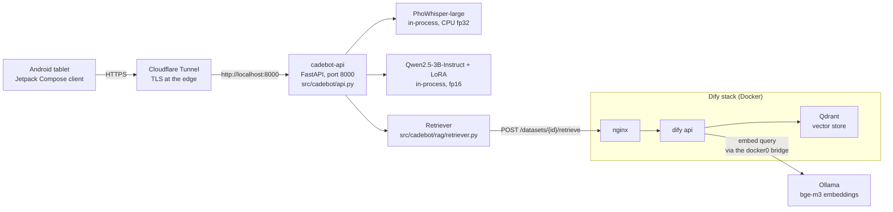
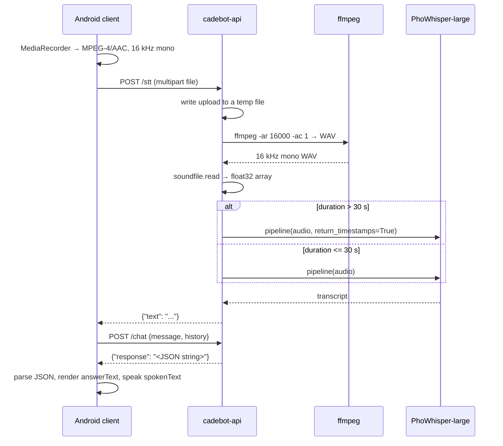
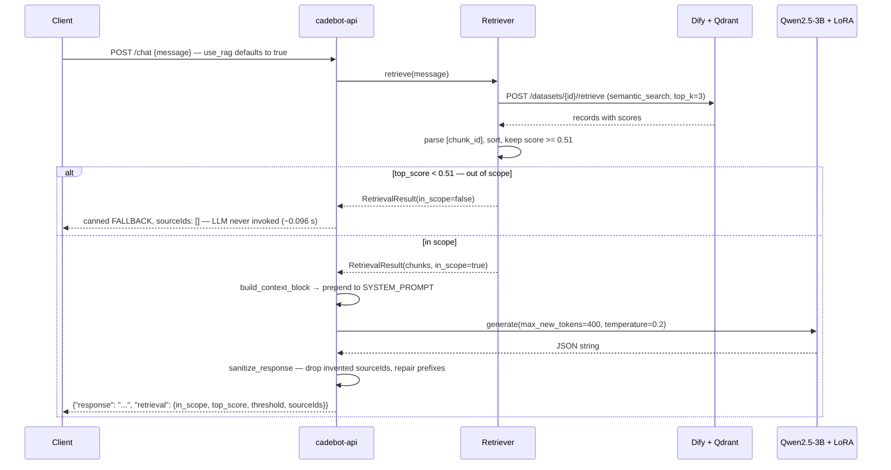

# Architecture

How Cadebot is put together, what each piece is responsible for, and why the
parts that look odd are the way they are.

- [System context](#system-context)
- [Components](#components)
- [The RAG package](#the-rag-package)
- [Request flows](#request-flows)
- [Key design decisions](#key-design-decisions)
- [Known limitations](#known-limitations)

---

## System context

The API process owns both models in memory. Retrieval is the only network hop
it makes, and it goes to Dify, which owns the vector store and calls Ollama to
embed the query with `bge-m3`. Ollama binds to `127.0.0.1` on the host, so a
small TCP relay (`knowledge_base/ollama_docker_bridge.py`) republishes it on the
`docker0` bridge address `172.17.0.1:11434` where Dify's containers can reach it.

---

## Components

| Component | Where it lives | Responsibility |
|---|---|---|
| API layer | `src/cadebot/api.py` | FastAPI app, the four routes, `SYSTEM_PROMPT`, CORS, the out-of-scope hard block |
| Model loading | `src/cadebot/models.py` | `load_stt()` and `load_chat()`; no FastAPI import, so the API module can be imported without weights |
| Entrypoint | `src/cadebot/__main__.py` | `python -m cadebot` — uvicorn on `HOST`/`PORT` (defaults `0.0.0.0:8000`) |
| RAG package | `src/cadebot/rag/` | Config, chunking, KB assembly, Dify client, retrieval, prompt construction |
| KB sync | `scripts/sync_kb.py` | Builds the two KB documents and upserts them into Dify (`--dry-run` prints instead) |
| Threshold calibration | `scripts/calibrate_threshold.py` | Scores the eval set at threshold 0, suggests the optimal cut |
| End-to-end eval | `scripts/eval_rag.py` | Hits the running server; `--fast` uses `/retrieve` and skips the LLM |
| Training | `training/finetune_cadebot.py`, `training/merge_model.py`, `training/eval_cadebot.py` | LoRA fine-tune, adapter merge, offline evaluation (CUDA host) |
| Knowledge base | `knowledge_base/` | Five Vietnamese markdown files, `demo_cafe.db` (SQLite), `schema.sql`, `ollama_docker_bridge.py` |
| Eval set | `eval/rag_queries.json` | 15 in-scope + 15 out-of-scope Vietnamese queries |
| Android client | `Cadebot_UI/` | Jetpack Compose tablet app: records audio, posts to `/stt` then `/chat`, speaks the answer with the Android TTS engine |
| Standalone voice loop | `pipeline/` | Local VAD → STT → LLM → TTS loop that does not need the Android client (`pipeline/main.py`) |
| Tests | `tests/rag/` | 49 tests: config invariants, chunking, DB chunking, KB assembly, prompt/sanitizing, retriever parsing, `/chat` behavior |

---

## The RAG package

`src/cadebot/rag/` is the part of the system that decides whether Cadebot is
allowed to answer at all. It runs in one direction at build time
(`knowledge_base/` → Dify) and in the other at request time (query → chunks →
context block).

**`config.py`** — the single source of truth. Every tunable is an environment
variable with a measured default: `EMBEDDING_MODEL=bge-m3` / `EMBEDDING_DIM=1024`
(locked — changing either forces a full re-embed), `SCORE_THRESHOLD=0.51`,
`TOP_K=3`, `SEARCH_METHOD="semantic_search"`, `MAX_CONTEXT_CHARS=2000`,
`GEN_TEMPERATURE=0.2`, `CHUNK_SEPARATOR="\n---\n"`, `CHUNK_MAX_TOKENS=2000`.
`REPO_ROOT` is derived from `__file__` (`parents[3]`) and overridable with
`CADEBOT_ROOT` so the container (`WORKDIR /app`) and the host agree.

**`chunker.py`** — turns the five markdown files into chunks with stable IDs.
Two strategies: `05_Bo_Cau_Hoi_Thuong_Gap_FAQ.md` becomes one chunk per `Q:`/`A:`
pair (`faq:md_001`, …); files `01`–`04` become one chunk per `##` section
(`doc:<file-slug>#<n>`), split further at `###` when a section has subsections
(`doc:<file-slug>#<n>.<m>`). Every chunk is rendered with its ID as the first
line — `[doc:02_Menu_Va_Phuong_Phap_Pha_Che#1.2]` — and markdown horizontal
rules (`---`, `***`, `___`) are stripped from the body by `_strip_rules()`.
Sub-chunks carry the file title and parent section heading so they still make
sense when retrieved alone. Total: 34 markdown chunks.

**`db_source.py`** — reads `knowledge_base/demo_cafe.db` and emits `menu:<item_code>`
for every available menu item, `promo:<promo_code>` for every promotion, and
`faq:db_<faq_id>` for every DB FAQ (the `db_` prefix keeps them from colliding
with the markdown `faq:md_*` IDs). The availability column is detected at
runtime because `schema.sql` (Postgres) calls it `is_available` while
`demo_cafe.db` (SQLite) calls it `available`. JSON `attributes` are flattened
into Vietnamese lines so the embedder can see them. Total: 35 database chunks.

**`kb_builder.py`** — joins rendered chunks with `CHUNK_SEPARATOR` (`\n---\n`)
into one document per source. Before joining it refuses any chunk containing a
bare `---` **line** — a substring check is not enough, because a chunk ending in
`...\n---` without a trailing newline would still produce `---\n---\n` after the
join, shifting Dify's segmentation by one and stripping the `[chunk_id]` line
off the following segment.

**`dify_kb.py`** — `DifyKnowledgeClient` talks to the Dify **Dataset** API (not
the App API; the App key returns 401). `upsert_document()` looks the document up
by name and either creates it (`/document/create_by_text`) or updates it
(`/documents/{id}/update_by_text`), so `sync_kb.py` is idempotent — repeated runs
leave exactly two documents, `cadebot_kb_markdown.md` and `cadebot_kb_database.md`.
It sends its own `process_rule` with `mode: custom`, the `\n---\n` separator,
`max_tokens: 2000` and `chunk_overlap: 0`.

**`retriever.py`** — posts to `POST {DIFY_BASE_URL}/datasets/{id}/retrieve` with
`search_method=semantic_search`, `reranking_enable=false`, `top_k=3` and
**`score_threshold_enabled=false`**: the threshold is applied locally so the raw
top score can be logged and calibrated. `parse_chunk_id()` recovers the ID from
the leading `[...]` line and returns `("unknown", content)` when it is missing.
Chunks are sorted by score, those at or above the threshold are kept, and
`in_scope` is simply "at least one chunk survived". If Dify errors or times out
(`RETRIEVAL_TIMEOUT=15` s) the result is an empty `RetrievalResult` — i.e.
out-of-scope. Failing closed is deliberate: refusing beats fabricating.

**`prompt.py`** — `build_context_block()` wraps the retrieved text in a
`### KNOWLEDGE HUB` block plus explicit instructions to use only that text and to
fill `sourceIds` with the bracketed IDs actually used. `fallback_response()`
returns the fixed `FALLBACK` payload in exactly the JSON schema the system prompt
mandates. `sanitize_response()` parses the model's output and rewrites
`sourceIds`, keeping only IDs that were really retrieved and repairing IDs that
lost their prefix (`VR_TIRAMISU` → `menu:VR_TIRAMISU`); if the output is not
valid JSON it is returned untouched rather than mangled further.

---

## Request flows

### Voice turn

Whisper only consumes 30 s at a time; anything longer needs the long-form path,
which requires the model to predict timestamp tokens — omitting `return_timestamps`
there raises `ValueError`. A robot listening continuously hits that branch often,
so it is handled as a normal case rather than an edge case.

### Grounded answer

Only the last 8 history turns are forwarded to the model (`req.history[-8:]`).

---

## Key design decisions

| Decision | Why | Source |
|---|---|---|
| Score threshold `0.51` | F1 0.968 / precision 0.938 / recall 1.000 over 30 calibration queries; the in-scope (min 0.526) and out-of-scope (max 0.540) distributions overlap by only 0.014 | `src/cadebot/rag/config.py`, [rag-setup.md](rag-setup.md) |
| Hard-block out-of-scope **before** the LLM | 0.08–0.10 s instead of 142–184 s, and it removes the fabrication path entirely instead of asking the model not to fabricate | `src/cadebot/api.py` |
| Chunk IDs embedded as a `[id]` first line | Dify's retrieval API returns segment *text*, not our metadata — the ID has to survive inside the content itself or provenance is lost | `src/cadebot/rag/chunker.py`, `src/cadebot/rag/retriever.py` |
| `max_tokens` 2000, not 500 | We already chunk ourselves, so Dify's limit is only a safety net; at 500 it re-split Vietnamese chunks and 34 markdown chunks became 46 segments, 13 of which lost their `[chunk_id]` line | `src/cadebot/rag/config.py` |
| Markdown horizontal rules stripped from chunks | A `---` line inside a chunk collides with the `\n---\n` separator, shifting every later segment by one | `src/cadebot/rag/chunker.py`, `src/cadebot/rag/kb_builder.py` |
| Generation temperature `0.2` (down from 0.7) | At 0.7 the model attached "best seller" to items the KB never described that way, pulling the phrase from fine-tuning weights rather than context | `src/cadebot/rag/config.py` |
| `use_rag` defaults to `true` | The Android client does not send the field, so the default *is* the shipped behavior. With RAG off the model answers from fine-tuning memory — inventing prices and promotions, with no out-of-scope block. Correctness outranks latency; a deployment blocked by a proxy timeout sends `use_rag: false` per request instead of lowering the system default | `src/cadebot/api.py`, `tests/rag/test_chat_endpoint.py` |
| `semantic_search`, not `hybrid_search` | Measured identical — Dify ignores `weights` when reranking is off — and `full_text_search` scores 0 on a High Quality index | [rag-setup.md](rag-setup.md) |

Two consequences worth stating out loud:

- The threshold is applied **in our code**, not by Dify (`score_threshold_enabled: false`),
  so `/retrieve` can report the true top score for any query. That is what made
  calibration possible at all.
- Because the Android client sends only `{message, history}`, the `use_rag`
  default decides real behavior. It is `true`, so the shipped client gets
  grounding and the out-of-scope hard block. It was briefly flipped to `false`
  on 2026-08-04 to dodge a proxy timeout and restored on 2026-08-14, since the
  cost was fabricated prices and promotions. The rule is pinned by
  `tests/rag/test_chat_endpoint.py::test_use_rag_defaults_on_for_android_payload`:
  a deployment constrained by a proxy timeout sends `use_rag: false` on the
  request, it does not lower the system default.

---

## Known limitations

- **CPU latency.** A grounded answer takes 142-184 s end to end on the
  deployment machine (no GPU). The fix is INT4 quantization or a GPU, not more
  retrieval work. See [performance.md](performance.md) for the measured
  breakdown and the Jetson Orin Nano projection. This also puts a grounded turn
  past the 100 s response limit imposed by a Cloudflare-Tunnel-fronted
  deployment — an operational constraint of that hosting choice, handled per
  request rather than by changing the default; see
  [deployment.md](deployment.md#public-exposure).
- **RAG blocks fabricated numbers, not fabricated attributes.** A price question
  returns the right price with the right `sourceIds`, but the model may still
  attach a property from a neighbouring retrieved chunk — observed: "Trà Đào Cam
  Sả" described as best seller when the KB says that of Viva Latte. Retrieval
  cannot fix this; prompting and fine-tuning can.
- **One out-of-scope query scores above threshold.** "cho tôi số điện thoại của
  bạn" scores 0.540, so 14 of 15 out-of-scope queries are blocked — and the label
  is arguably wrong, since the KB really does contain a hotline. Raising the
  threshold above 0.540 would wrongly block "có chỗ đậu xe" (0.526) and "quán mở
  cửa mấy giờ" (0.530).
- **Single-process serving.** One uvicorn process holds both models; concurrent
  `/chat` calls serialize behind the GIL and the model itself. There is no queue,
  no batching and no backpressure.
- **No authentication.** `/chat` is unauthenticated and CORS is `allow_origins=["*"]`.
  Acceptable behind a private tunnel hostname for a demo; see
  [deployment.md](deployment.md#security-notes).

---

**Related:** [deployment.md](deployment.md) · [api-reference.md](api-reference.md) ·
[rag-setup.md](rag-setup.md) (Vietnamese) · [performance.md](performance.md) (Vietnamese)
