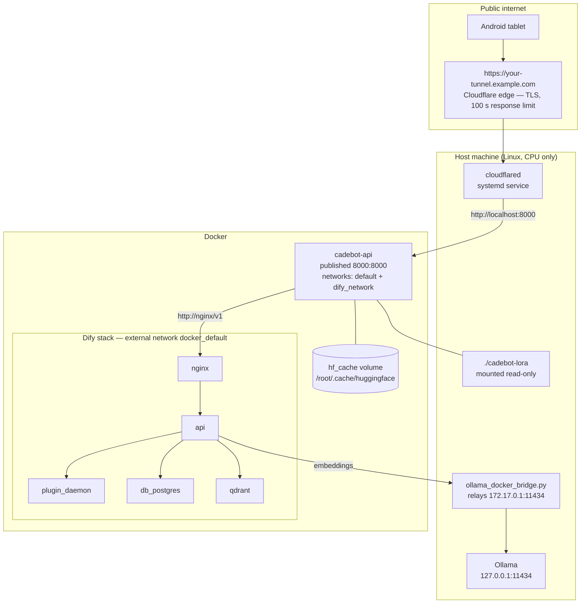

# Deployment

Cadebot runs as a single Docker container on one ordinary Linux machine with no
GPU, joined to a self-hosted Dify stack over Docker networking, and exposed to
the internet through a Cloudflare Tunnel — no inbound ports opened on the host.

Everything below describes the committed `Dockerfile`, `docker-compose.yml` and
`Makefile`. There is no other infrastructure.

- [Topology](#topology)
- [Why the image is built this way](#why-the-image-is-built-this-way)
- [Quick start](#quick-start)
- [Operations](#operations)
- [Public exposure](#public-exposure)
- [Security notes](#security-notes)
- [Troubleshooting](#troubleshooting)

---

## Topology



### Ports

| Port | Bound to | Published? | Why |
|---|---|---|---|
| `8000` | `cadebot-api` container | **Yes** — `8000:8000` in `docker-compose.yml` | The only thing the Cloudflare Tunnel points at |
| `80` | Dify `nginx` | Published by **Dify's own** compose file, not ours | Browser access to the Dify console at `http://localhost` and host-side `curl` against `http://localhost/v1` |
| `6333` | `qdrant` | No | Reached only as `http://qdrant:6333` from inside the Dify network |
| Postgres | `db_postgres` | No | Internal to the Dify stack |
| Dify `api` | `api` | No | Fronted by `nginx`; Cadebot addresses it as `http://nginx/v1` |
| `11434` | Ollama | No — `127.0.0.1` only | Loopback by default; `knowledge_base/ollama_docker_bridge.py` relays it onto `172.17.0.1:11434` so Dify's containers can reach it |

Nothing else is published. The host firewall needs no inbound rules at all —
`cloudflared` makes an **outbound** connection to Cloudflare and the traffic
comes back down that tunnel.

---

## Why the image is built this way

### 1. CPU-only torch wheel

```dockerfile
RUN pip install --no-cache-dir torch==2.10.0 --index-url https://download.pytorch.org/whl/cpu \
    && pip install --no-cache-dir -r requirements.txt
```

The default PyPI `torch` wheel bundles the CUDA runtime — roughly 3 GB of shared
libraries that are pure dead weight on a machine without an NVIDIA GPU. Pulling
from PyTorch's CPU index keeps the image small and the build fast. `requirements.txt`
also pins `torch==2.10.0`; because it is already satisfied by the first install,
pip does not replace it with the CUDA build.

### 2. Weights are mounted, not baked

```yaml
volumes:
  - ./cadebot-lora:/app/cadebot-lora:ro
  - hf_cache:/root/.cache/huggingface
```

The LoRA adapter is bind-mounted read-only from the repo, and the HuggingFace
cache is a **named volume**. The ~6 GB of base weights (Qwen2.5-3B-Instruct plus
PhoWhisper-large) are downloaded on first boot into `hf_cache` and survive every
rebuild and restart afterwards.

Baking them in would produce an image too large to push anywhere useful and would
turn every `docker compose build` into a multi-gigabyte re-download. The trade-off
is that the container is not self-contained: it needs the mount and, on first
boot, network access to the HuggingFace hub.

`src/cadebot/rag/config.py` reads `CADEBOT_MODEL_DIR` (default `<repo>/cadebot-lora`),
so the same code finds the adapter at `/app/cadebot-lora` in the container and at
the repo path on the host.

### 3. Two networks, and why `DIFY_BASE_URL` is overridden

```yaml
    networks:
      - default
      - dify_network
networks:
  default:
  dify_network:
    external: true
    name: docker_default
```

Dify's compose project is called `docker`, so its default network is named
`docker_default`. Declaring it `external: true` attaches `cadebot-api` to a
network it does not own, which lets the API address Dify by service name.

That is why `docker-compose.yml` sets

```yaml
    environment:
      DIFY_BASE_URL: http://nginx/v1
```

rather than inheriting the value from `.env`. On the host, `.env` says
`http://localhost/v1` and that is correct — for a host process. Inside a
container, `localhost` is the container itself, so the same value would fail.
The compose `environment:` block wins over `env_file:`, so both host scripts
(`scripts/sync_kb.py`, `scripts/calibrate_threshold.py`) and the containerized
API work from the same `.env`.

**Consequence:** the Dify stack must already be running. If `docker_default` does
not exist, `docker compose up` fails immediately.

### 4. `ffmpeg` and `libsndfile1`

```dockerfile
RUN apt-get update && apt-get install -y --no-install-recommends \
    ffmpeg \
    libsndfile1 \
    && rm -rf /var/lib/apt/lists/*
```

`POST /stt` shells out to `ffmpeg` to normalize whatever the client uploaded
(the Android app sends MPEG-4/AAC `.m4a`) into 16 kHz mono WAV, which is what
PhoWhisper expects. `soundfile`, used to read that WAV into a float32 array,
links against `libsndfile1`. Neither is a Python dependency, so neither arrives
with `pip install`.

The build context itself is tiny — `.dockerignore` denies everything and
re-admits only `requirements.txt` and `src/`:

```dockerignore
*
!requirements.txt
!src/
**/__pycache__
**/*.pyc
```

---

## Quick start

In dependency order. The Dify stack has to be up first, because the Cadebot
compose file joins its network.

```bash
# 1. Prerequisites: Docker + Compose, ~20 GB free disk, Ollama with bge-m3.
ollama pull bge-m3
curl -s http://127.0.0.1:11434/api/embed \
  -d '{"model":"bge-m3","input":"test"}' \
  | python3 -c "import json,sys; print('dim =', len(json.load(sys.stdin)['embeddings'][0]))"
# → dim = 1024   (anything else means config.EMBEDDING_DIM must change BEFORE the KB is built)

# 2. Bring up the Dify stack. First-time setup — admin account, the Ollama
#    plugin, the dataset — is in docs/rag-setup.md.
cd <path-to>/dify/docker && docker compose --profile postgresql --profile qdrant up -d

# 3. Let Dify's containers reach Ollama (it listens on 127.0.0.1 only).
cd <path-to>/Qwen2.5-3B-fine-tuned
python3 knowledge_base/ollama_docker_bridge.py &

# 4. Configure Cadebot.
cp .env.example .env && "$EDITOR" .env    # fill in DIFY_DATASET_API_KEY + DIFY_DATASET_ID

# 5. Sync the knowledge base from the host.
set -a && source .env && set +a
python3 scripts/sync_kb.py --dry-run      # 34 markdown + 35 database = 69 chunks
python3 scripts/sync_kb.py                # upsert into Dify — 2 documents, idempotent

# 6. Build and run the API.
make up                                   # docker compose up -d --build
make logs                                 # wait for "✅ Chat model ready!"
make health
```

`make health` should print:

```json
{"status":"ok","stt_ready":true,"chat_ready":true,"rag_ready":true,
 "embedding_model":"bge-m3","score_threshold":0.51}
```

> **First boot is slow.** Before the models are ready the container downloads
> roughly 6 GB of weights into the `hf_cache` volume — several minutes on a good
> connection, and the API does not answer until the lifespan hook finishes.
> Every later start reuses the cache and only pays model load time. `make clean`
> deletes that volume and forces the download again.

### Running without Docker

For development, or on a machine where you do not want the Dify network
dependency:

```bash
pip install -r requirements.txt
set -a && source .env && set +a
python3 -m cadebot        # uvicorn on HOST:PORT, default 0.0.0.0:8000
```

`python3 -m cadebot` reads `HOST` and `PORT` from the environment
(`src/cadebot/__main__.py`). With `DIFY_DATASET_API_KEY` / `DIFY_DATASET_ID`
unset, startup prints a warning and the server runs with `rag_ready: false` —
`/chat` still works, `/retrieve` returns an error object.

---

## Operations

### `make` targets

| Target | What it runs | When to reach for it |
|---|---|---|
| `make help` | Prints every documented target | Start here |
| `make up` | `docker compose up -d --build` | Normal start; rebuilds if the image is stale |
| `make down` | `docker compose down` | Stop and remove the container (volumes survive) |
| `make restart` | `down` then `up` | After editing `.env` or `docker-compose.yml` |
| `make build` | `docker compose build` | Rebuild the image without starting it |
| `make logs` | `docker compose logs -f cadebot-api` | Watch boot progress; Ctrl+C detaches, it does not stop the container |
| `make ps` | `docker compose ps` | Is it running, is it restarting |
| `make health` | `curl` on `localhost:8000/health`, plus `$PUBLIC_URL/health` when `PUBLIC_URL` is set | First check after any change |
| `make test` | `python3 -m pytest tests/ -q` | Runs on the host, needs no container |
| `make tunnel-status` | `systemctl status cloudflared` | Public URL unreachable but local `/health` fine |
| `make tunnel-restart` | `sudo systemctl restart cloudflared` | Tunnel wedged after a network change |
| `make tunnel-logs` | `sudo journalctl -u cloudflared -f` | Diagnosing 502/524 at the edge |
| `make clean` | `down`, then `docker compose down -v` | **Destructive** — deletes the `hf_cache` volume, so the next boot re-downloads ~6 GB of weights. Only for a genuinely clean slate. |

The three `tunnel-*` targets assume `cloudflared` is installed as a systemd unit
on the host. They are inert on a LAN-only deployment — see
[Public exposure](#public-exposure).

### Updating the knowledge base

Edit the markdown under `knowledge_base/` or the rows in `demo_cafe.db`, then:

```bash
set -a && source .env && set +a
python3 scripts/sync_kb.py --dry-run   # confirm the chunk counts and IDs
python3 scripts/sync_kb.py             # upsert; still exactly 2 Dify documents
```

Wait for Dify to finish indexing (Knowledge → Documents → **Available**), then
re-check the threshold if the KB changed materially:

```bash
python3 scripts/calibrate_threshold.py
python3 scripts/eval_rag.py --fast     # needs the server running
```

The API does not need a restart for KB changes — retrieval is a live call to
Dify. It **does** need a restart when `SCORE_THRESHOLD` or any other value in
`.env` changes, since `config.py` reads the environment at import time.

---

## Public exposure

Public exposure is **optional** — on a LAN, clients reach `http://<host-ip>:8000`
directly and nothing below applies. When the server does need to be reachable
from the internet, the approach used here is a **Cloudflare Tunnel**:
`cloudflared` runs as a systemd unit on the host, holds an outbound connection to
Cloudflare's edge, and its ingress rules map a hostname to `http://localhost:8000`.
All hostnames in this document are placeholders; substitute your own.

```yaml
# ~/.cloudflared/config.yml — shape only; use your own tunnel id and hostname
tunnel: <tunnel-id>
credentials-file: <path-to>/.cloudflared/<tunnel-id>.json
ingress:
  - hostname: your-tunnel.example.com
    service: http://localhost:8000
  - service: http_status:404
```

What this buys:

- No inbound firewall rules and no port forwarding — the host can sit behind NAT.
- TLS terminated at Cloudflare, with a valid certificate, for free.
- The origin's real address is never published.

What it costs, and it is not a small thing here:

> **Cloudflare's edge enforces a hard 100 s limit on the origin's response.**
> Exceed it and the client gets **HTTP 524**, regardless of what the origin is
> doing.

### The 100 s limit vs. grounded answers

Measured on the CPU-only deployment host. Two runs are shown because generation
time moves a lot with what else the machine is doing — treat these as a range,
not a spec:

| Request | 2026-07-29 | 2026-08-14 | Through a Cloudflare Tunnel? |
|---|---|---|---|
| `/retrieve` (no LLM) | — | **0.06 – 0.11 s** | Fine |
| `/chat`, out of scope (grounded, hard-blocked) | **0.096 s** | **0.081 s** | Fine |
| `/chat`, in scope, grounded (`use_rag: true`) | **~142 s** | **183.9 s** | **HTTP 524** |
| `/chat`, ungrounded (`use_rag: false`) | **~95 s** | not re-measured | Squeaks through |

> Conditions for the 2026-08-14 column: Intel CPU, no GPU, `cadebot-api` running
> alongside the full 15-container Dify stack on the same machine, `max_new_tokens`
> 400, `TOP_K` 3. The 2026-07-29 figures were taken during threshold calibration
> on a less loaded machine. The gap between 142 s and 184 s is contention, not a
> regression — but it means **any number here is a measurement, not a guarantee**.
> Re-measure on the target hardware before making a hosting decision.

The shape of the result is what matters and it is stable across both runs:
retrieval is effectively free (~0.1 s), rejecting an out-of-scope question is
effectively free because the LLM is never invoked, and **only the grounded
generation path is slow** — comfortably past 100 s either way.

`use_rag` defaults to **`true`** in `src/cadebot/api.py`, and that default is
correct: with grounding off the model answers from fine-tuning memory, inventing
prices and promotions, and the out-of-scope hard block disappears. The 100 s
limit is a property of *this particular hosting choice*, not of the system.

**So handle it at the deployment layer, not by lowering the default:**

- A client that must go through the tunnel and cannot wait sends
  `{"use_rag": false}` **on the request**. That is a per-deployment trade-off,
  made explicitly, and it is the client accepting ungrounded answers.
- Better: give `cloudflared` a route that is not the public one — a LAN address
  or a VPN — for clients that can reach the host directly. Nothing at the edge
  applies then.
- Best: make generation fast enough that the question disappears (GPU, or INT4
  quantization; see [performance.md](performance.md) §4).

`tests/rag/test_chat_endpoint.py::test_use_rag_defaults_on_for_android_payload`
pins the default to `true` so it cannot be flipped by accident. The default was
briefly `false` between 2026-08-04 and 2026-08-14 for exactly this reason, and
was restored because the cost — fabricated prices — was worse than the 524.

Point the Android client at the public hostname by setting `cadebot.api.url` in
`Cadebot_UI/local.properties` (gitignored). The compiled-in fallback is
`http://10.0.2.2:8000`, the emulator's alias for the host machine.

To probe the public endpoint alongside the local one:

```bash
PUBLIC_URL=https://your-tunnel.example.com make health
```

---

## Security notes

The current posture is "demo behind a private hostname", and it should be read
that way:

| Property | Current state | Where |
|---|---|---|
| CORS | `allow_origins=["*"]`, all methods, all headers | `src/cadebot/api.py` |
| Authentication | **None** on `/chat`, `/stt`, `/retrieve`, `/health` | `src/cadebot/api.py` |
| Rate limiting | None | — |
| Transport | HTTPS to the Cloudflare edge; plain HTTP from `cloudflared` to `localhost:8000` | tunnel config |
| Secrets | `.env` only, gitignored; `.env.example` holds placeholders | `.gitignore` |
| Weights mount | Read-only (`:ro`) | `docker-compose.yml` |

Anyone who learns the hostname can spend the machine's CPU. Before this is
anything more than a demo, the first three rows are what to change: a shared
token or Cloudflare Access in front of the tunnel, an allow-list of origins
instead of `*`, and a request limit. Nothing in the code depends on CORS being
open — the Android client is not a browser.

---

## Troubleshooting

| Symptom | Cause | Fix |
|---|---|---|
| `docker compose up` fails: network `docker_default` not found | The Dify stack was never started, so the external network does not exist | Start Dify first — quick start step 2 |
| `plugin_daemon` / `nginx` crash-looping | They started before Postgres was healthy | `docker restart docker-plugin_daemon-1 docker-nginx-1` |
| Dify starts but `plugin_daemon` cannot resolve `db_postgres` | Started without the `postgresql` profile | `docker compose --profile postgresql --profile qdrant up -d` |
| `/health` shows `rag_ready: false` | `DIFY_DATASET_API_KEY` / `DIFY_DATASET_ID` unset or wrong; the startup probe also logs a warning | Check `.env`, then `make restart` — `config.py` reads the environment at import time |
| Dify returns 401 | The App API key was used instead of the Dataset API key | Knowledge → API Access → API Key → Create |
| Client gets HTTP 524 | A grounded turn (142–184 s measured) exceeded Cloudflare's 100 s edge limit | Have that client send `{"use_rag": false}` per request, reach the host off-tunnel, or move generation to a GPU — do **not** change the server default; see [above](#the-100-s-limit-vs-grounded-answers) |
| First boot appears hung | Downloading ~6 GB of weights into `hf_cache` | `make logs`, wait for `✅ Chat model ready!` |
| Ollama unreachable from Dify ("Connection refused" when registering the model) | Ollama listens on `127.0.0.1` only | Run `knowledge_base/ollama_docker_bridge.py`; see [rag-setup.md](rag-setup.md) §3 |
| Retrieval returns segments with `chunk_id: "unknown"` | A segment lost its leading `[chunk_id]` line — usually a `---` inside a chunk, or `CHUNK_MAX_TOKENS` set too low | Re-run `scripts/sync_kb.py`; `kb_builder.build_document` raises on the offending chunk |
| `/stt` fails on an upload | `ffmpeg` could not decode the container format | Check `make logs` for the ffmpeg stderr; the client must send something ffmpeg can read |
| Models re-download after a rebuild | The `hf_cache` volume was removed (`make clean` / `docker compose down -v`) | Nothing to do but wait; avoid `-v` unless you mean it |

---

**Related:** [architecture.md](architecture.md) · [api-reference.md](api-reference.md) ·
[rag-setup.md](rag-setup.md) (Vietnamese — Dify/Qdrant/Ollama first-time setup) ·
[performance.md](performance.md) (Vietnamese — latency measurements)
